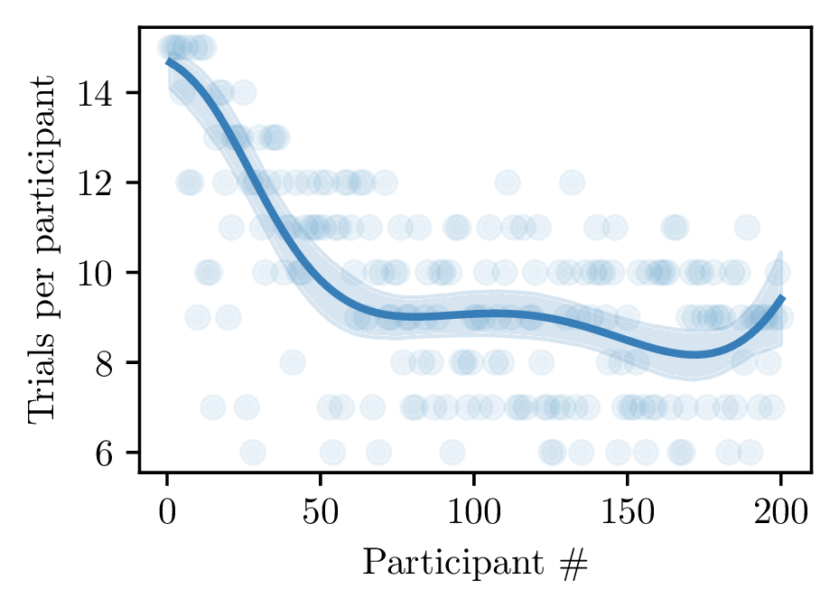

# Active inference for real-time adaptive testing with PsyNet

This experiment implements real-time adaptive testing using active inference in PsyNet.

Active inference is a joint-theory of action and perception in biological systems with applications in machine learning.
We show that it can also be used for optimizing an experimental setup in real-time.

In fact, for experiments with pure epistemic (i.e. information-seeking) goals, active inference is equivalent to
Variational Bayesian Optimal Experimental Design.
However, active inference can generalize Bayesian Optimal Design to cases in which experiments seek to achieve specific
outcomes.

This repository implements two experiments, each of which is based on trivia questions from Dubourg et al., 2025.

## Experiment 1 (branch: main)

In the first experiment, we apply active inference to infer participants' ability in a target domain by administering as
few tests as possible.
The optimal challenge to present to each participant is evaluated at every step by maximizing the expected information
gain using variational inference methods for efficient computation.
We achieve a 33% reduction in the tests administered with negligible information loss in a simulation based on real human data.

         Trials per participant         |  Accuracy of adaptive design versus the oracle (static)
:--------------------------------------:|:-------------------------:
  |  

## Experiment 2 (branch: active-inference)

The second experiment illustrates the adaptive search for optimal treatments.
In our case, we seek the trivia questions that are most associated with the education-level of the participants.

We again appeal to active inference, which naturally combines information-seeking with extrinsic/utilitarian
motivations. Active inference naturally "resolves" the exploration/exploitation trade-off without any ad-hoc mechanism,
which makes it an attractive alternative to traditional RL and Bayesian learning approaches.

# PsyNet

This experiment is implemented using the [PsyNet framework](https://www.psynet.dev/).

For installation instructions, see docs/INSTALL.md.

For a list of run commands, see docs/RUN.md.

For more information about PsyNet, see the [documentation website](https://psynetdev.gitlab.io/PsyNet/).

# References

* Friston, K., Rigoli, F., Ognibene, D., Mathys, C., Fitzgerald, T., & Pezzulo, G. (2015). Active inference and
  epistemic value. *Cognitive Neuroscience*, 6(4), 187-214.
* Parr, T., Pezzulo, G., & Friston, K. J. (2022). *Active inference: the free energy principle in mind, brain, and
  behavior*. MIT Press.
* Sajid, N., Ball, P. J., Parr, T., & Friston, K. J. (2021). Active Inference: Demystified and Compared. *Neural
  Computation*, 33(3), 674-712.
* Foster, A., Jankowiak, M., Bingham, E., Horsfall, P., Teh, Y. W., Rainforth, T., & Goodman, N. (2019). Variational
  Bayesian optimal experimental design. *Advances in neural information processing systems*, 32.
* Lindley, D. V. (1956). On a Measure of the Information Provided by an Experiment. *The Annals of Mathematical
  Statistics*, 27(4), 986-1005.
* Myung, J. I., Cavagnaro, D. R., & Pitt, M. A. (2013). A tutorial on adaptive design optimization. *Journal of
  Mathematical Psychology*, 57(3-4), 53-67.
* Rainforth, T., Foster, A., Ivanova, D. R., & Bickford Smith, F. (2023). Modern Bayesian Experimental Design. *arXiv
  preprint arXiv:2302.14545*.
* Sajid, N., Da Costa, L., Parr, T., & Friston, K. (2022). Active inference, Bayesian optimal design, and expected
  utility. In *The drive for knowledge: The science of human information seeking* (pp. 124-146). Cambridge University
  Press.
* Harrison, P. M. C., Marjieh, R., Adolfi, F., van Rijn, P., Anglada-Tort, M., Tchernichovski, O., Larrouy-Maestri,
  P., & Jacoby, N. (2020). Gibbs Sampling with People. *Advances in Neural Information Processing Systems*, 33.
* Sanborn, A., & Griffiths, T. (2007). Markov Chain Monte Carlo with People. *Advances in Neural Information Processing
  Systems*, 20.
* Bingham, E., Chen, J. P., Jankowiak, M., Obermeyer, F., Pradhan, N., Karaletsos, T., Singh, R., Szerlip, P. A.,
  Horsfall, P., & Goodman, N. D. (2019). Pyro: Deep Universal Probabilistic Programming. *Journal of Machine Learning
  Research*, 20, 28:1-28:6.
* Blei, D. M., Kucukelbir, A., & McAuliffe, J. D. (2017). Variational Inference: A Review for Statisticians. *Journal of
  the American Statistical Association*, 112(518), 859-877.
* Dubourg, E., Dheilly, T., Mercier, H., & Morin, O. (2025). Using the Nested Structure of Knowledge to Infer What
  Others Know. *Psychological Science*, 36(6), 443-450.