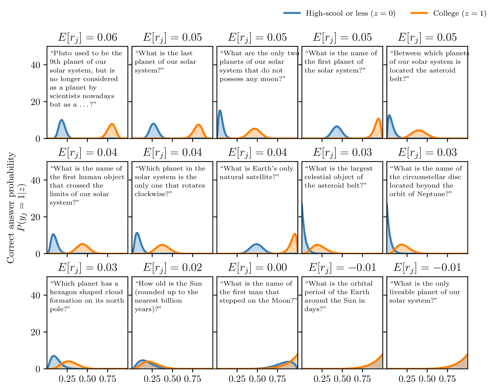

# Active inference for real-time adaptive testing with PsyNet

<!-- TOC -->
* [Experiment 1](#experiment-1-branch-main)
* [Experiment 2](#experiment-2-branch-active-inference)
* [Running this experiment](#running-this-experiment)
  * [GitHub Codespaces](#github-codespaces)
  * [Locally in a virtual environment](#locally-in-a-virtual-environment)
  * [Other options](#other-options)
* [References](#references)
<!-- TOC -->

This experiment implements real-time adaptive testing using active inference in PsyNet.

Active inference is a joint-theory of action and perception in biological systems with applications in machine learning.
We show that it can also be used for optimizing an experimental setup in real-time.

In fact, for experiments with pure epistemic (i.e. information-seeking) goals, active inference is equivalent to
Variational Bayesian Optimal Experimental Design.
However, active inference can generalize Bayesian Optimal Design to cases in which experiments seek to achieve specific
outcomes.

This repository implements two experiments, each of which is based on trivia questions from Dubourg et al., 2025.

## Experiment 1 (branch: main)

In the first experiment, we apply active inference to infer participants' ability in a target domain by administering as
few tests as possible.
The optimal challenge to present to each participant is evaluated at every step by maximizing the expected information
gain using variational inference methods for efficient computation.
We achieve a 33% reduction in the tests administered with negligible information loss in a simulation based on real human data.

| Trials per participant throughout the experiment |  Accuracy of adaptive design versus the oracle (static) |
|:------------------------------------------------:|:--------------------------------------------------------:|
|            |                         |

## Experiment 2 (branch: active-inference)

The second experiment illustrates the adaptive search for optimal treatments.
In our case, we seek the trivia questions that are most associated with the education-level of the participants.

We again appeal to active inference, which naturally combines information-seeking with extrinsic/utilitarian
motivations. Active inference naturally "resolves" the exploration/exploitation trade-off without any ad-hoc mechanism,
which makes it an attractive alternative to traditional RL and Bayesian learning approaches.


| Cumulative frequency of treatments administered as a function of the treatments performance (darkblue is better, lightblue is worse) | Contribution of exploration and exploitation to the expected free energy |
|:------------------------------------------------------------------------------------------------------------------------------------:|:------------------------------------------------------------------------:|
|                                                                                             |                                                       |




## Running this experiment

### GitHub Codespaces

The simplest way to work with this experiment is to run it in GitHub Codespaces.
For this to work, you must first verify that:

1. This project is hosted in a GitHub repository;
2. This README file is located at the top level of that GitHub repository (i.e. not in a subdirectory).
3. You are logged into GitHub.

If the above requirements are satisfied, you can launch the experiment in Codespaces as follows.
On the repository page, click the green "Code" button, click "Codespaces",
and then click "Create codespace on main".
The codespace will take a while to start up, because it needs to install the dependencies,
but don't worry, this is a one-time process.
Once the codespace is ready, you can then launch the experiment in debug mode by running the
following terminal command:

```bash
psynet debug local
```

Wait a moment, and then a browser window should open containing a link to the dashboard.
Click it, then enter 'admin' as both username and password, then press OK.
You'll now see the experiment dashboard.
Click 'Development', then 'New participant', to create a link to try the experiment
as a participant.

### Locally in a virtual environment

A more conventional approach is to instead run this demo locally in a virtual environment.
This is more involved as you have to install several related dependencies like Redis and PostgreSQL.
To do so, navigate to the [PsyNet website](https://psynet.dev) and follow the 'virtual environment'
installation instructions. Check `constraints.txt` to find the recommended Python version
for this experiment.

### Other options

It should also be possible to load this repository using Devcontainers in an IDE such as VSCode.
In theory, this should function equivalently to GitHub Codespaces. However, this hasn't worked
so reliably for us yet, and we're still figuring out how to make it work better.


## References

* Friston, K., Rigoli, F., Ognibene, D., Mathys, C., Fitzgerald, T., & Pezzulo, G. (2015). Active inference and
  epistemic value. *Cognitive Neuroscience*, 6(4), 187-214.
* Parr, T., Pezzulo, G., & Friston, K. J. (2022). *Active inference: the free energy principle in mind, brain, and
  behavior*. MIT Press.
* Sajid, N., Ball, P. J., Parr, T., & Friston, K. J. (2021). Active Inference: Demystified and Compared. *Neural
  Computation*, 33(3), 674-712.
* Foster, A., Jankowiak, M., Bingham, E., Horsfall, P., Teh, Y. W., Rainforth, T., & Goodman, N. (2019). Variational
  Bayesian optimal experimental design. *Advances in neural information processing systems*, 32.
* Lindley, D. V. (1956). On a Measure of the Information Provided by an Experiment. *The Annals of Mathematical
  Statistics*, 27(4), 986-1005.
* Myung, J. I., Cavagnaro, D. R., & Pitt, M. A. (2013). A tutorial on adaptive design optimization. *Journal of
  Mathematical Psychology*, 57(3-4), 53-67.
* Rainforth, T., Foster, A., Ivanova, D. R., & Bickford Smith, F. (2023). Modern Bayesian Experimental Design. *arXiv
  preprint arXiv:2302.14545*.
* Sajid, N., Da Costa, L., Parr, T., & Friston, K. (2022). Active inference, Bayesian optimal design, and expected
  utility. In *The drive for knowledge: The science of human information seeking* (pp. 124-146). Cambridge University
  Press.
* Harrison, P. M. C., Marjieh, R., Adolfi, F., van Rijn, P., Anglada-Tort, M., Tchernichovski, O., Larrouy-Maestri,
  P., & Jacoby, N. (2020). Gibbs Sampling with People. *Advances in Neural Information Processing Systems*, 33.
* Sanborn, A., & Griffiths, T. (2007). Markov Chain Monte Carlo with People. *Advances in Neural Information Processing
  Systems*, 20.
* Bingham, E., Chen, J. P., Jankowiak, M., Obermeyer, F., Pradhan, N., Karaletsos, T., Singh, R., Szerlip, P. A.,
  Horsfall, P., & Goodman, N. D. (2019). Pyro: Deep Universal Probabilistic Programming. *Journal of Machine Learning
  Research*, 20, 28:1-28:6.
* Blei, D. M., Kucukelbir, A., & McAuliffe, J. D. (2017). Variational Inference: A Review for Statisticians. *Journal of
  the American Statistical Association*, 112(518), 859-877.
* Dubourg, E., Dheilly, T., Mercier, H., & Morin, O. (2025). Using the Nested Structure of Knowledge to Infer What
  Others Know. *Psychological Science*, 36(6), 443-450.